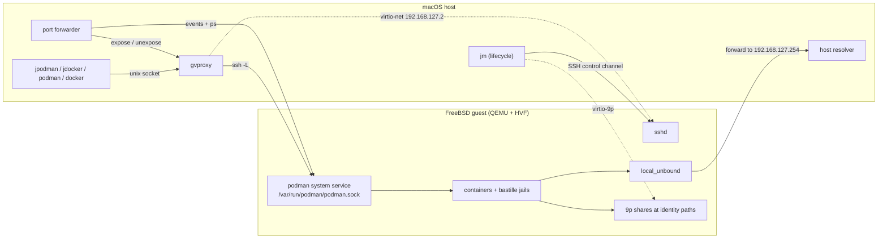

# jailmachine

`jailmachine` (`jm`) is `docker-machine` / `podman machine` for FreeBSD. One
command brings up a FreeBSD 15.1 virtual machine on your Mac, provisions it
with `podman` and `bastille`, and hands your host's `podman` or `docker`
client an endpoint pointing at it — so you can run **native FreeBSD OCI
images**, **Linux images** through the Linuxulator, and **jails**, from a
macOS terminal, without keeping a FreeBSD box around.

> **Status: MVP / working demo.** This proves the idea end to end and is
> usable for real work: `jm init && jm start`, then build and run FreeBSD and
> Linux images, publish ports to the host, create jails in the guest. Since
> v0.1.0 it also shares host directories at identical paths, resolves names
> exactly as your Mac does, starts the machine on demand from `jpodman` /
> `jdocker`, and ships a `jdocker` wrapper for the docker CLI. It is still not
> a Docker Desktop replacement: see
> [what works, and what does not yet](#what-works-and-what-does-not-yet).

## Install

macOS on Apple Silicon only. `qemu` (for HVF) and `podman` (which also ships
`gvproxy`) are required; the cask declares both and creates the `jpodman` and
`jdocker` symlinks, otherwise they are yours to arrange.

```bash
brew install --cask gabrielbelli/tap/jailmachine

# or:
brew install qemu podman
go install github.com/gabrielbelli/jailmachine/cmd/jm@latest
ln -sf "$(go env GOPATH)/bin/jm" "$(go env GOPATH)/bin/jpodman"
ln -sf "$(go env GOPATH)/bin/jm" "$(go env GOPATH)/bin/jdocker"

# or, from source (PREFIX defaults to /opt/homebrew):
git clone https://github.com/gabrielbelli/jailmachine && cd jailmachine && make install
```

`jm doctor` checks every tool and machine and prints a fix per failure.
Details in [docs/INSTALL.md](docs/INSTALL.md).

## 60-second quickstart

```bash
jm init      # SSH key, download and verify the guest image, grow the disk, write the seed
jm start     # boot, provision, connect podman, share host paths, start the forwarder and resolver
```

`jm init` takes about 45–60 s, dominated by the roughly 800 MiB image
download and its mandatory SHA256 check. On the prebaked image a cold first
boot takes about 22 s (32 s was observed once with two other VMs already
running on the host) and a warm start 12–25 s; `--image official:<release>`
provisions a stock FreeBSD cloud image on first boot instead, taking about
2 minutes.

`jpodman` is `podman` pointed at the machine and `jdocker` is the docker CLI
pointed at the same engine, whatever your default connection or docker context
is; jm never repoints a default you already had (`jm start --set-default` opts
in, and on a Mac with no podman connections at all, podman itself promotes the
first one jm registers). **Both wrappers start a stopped machine for you**,
printing one line on stderr while it boots — `JM_AUTOSTART=0`, or
`--no-autostart` as the first argument, makes them fail instead.

The guest is FreeBSD, so **Linux images need `--os=linux`** with podman:

```bash
jpodman run --rm --os=linux docker.io/alpine echo hi              # Linux, via the Linuxulator
jpodman run --rm ghcr.io/freebsd/freebsd-runtime:15.1 uname -srm  # native FreeBSD
```

`jdocker` needs no flag — the docker CLI has none, so the wrapper defaults
`DOCKER_DEFAULT_PLATFORM=linux/arm64` and a plain `jdocker run` pulls the
Linux image as Docker Desktop would. Set `DOCKER_DEFAULT_PLATFORM` yourself,
or pass `--platform`, for native FreeBSD images.

```bash
jdocker run --rm docker.io/alpine echo hi
jdocker compose up -d          # a compose.yaml, driving the guest's podman
jpodman kube play pod.yaml     # or Kubernetes YAML, FreeBSD's native route
```

Those two and `jpodman compose` are all covered in
[Compose and Kubernetes YAML](docs/USAGE.md#compose-and-kubernetes-yaml).

Build a native FreeBSD image:

```bash
cat > Containerfile <<'EOF'
FROM ghcr.io/freebsd/freebsd-runtime:15.1
RUN env ASSUME_ALWAYS_YES=yes pkg bootstrap -f && pkg install -y curl && pkg clean -ay
CMD ["uname", "-srm"]
EOF
jpodman build -t jm-demo . && jpodman run --rm jm-demo
```

Publish a port and reach it from the Mac (the forwarder reconciles a second
or two after the container starts, hence the retry):

```bash
jpodman run -d --rm --os=linux -p 8080:80 --name web docker.io/busybox \
  sh -c 'echo hello from the FreeBSD VM > /tmp/index.html && httpd -f -p 80 -h /tmp'
curl --retry 10 --retry-connrefused http://localhost:8080/   # hello from the FreeBSD VM
jm ports              # what is mapped, where it binds, and why something is not
jpodman rm -f web
```

For plain `podman` or a docker client you would rather point yourself:
`eval "$(jm env)"` (fish: `eval (jm env --shell fish)`). A Linux image in a
compose file or a Pod manifest needs its platform naming — see
[Compose and Kubernetes YAML](docs/USAGE.md#compose-and-kubernetes-yaml).

## Sharing host directories

Host directories appear in the guest **at the same absolute path**, so a
volume argument written on the Mac resolves inside the VM unchanged — from
any directory, with no rewriting and no `/host_mnt` prefix:

```bash
jpodman run --rm --os=linux -v ~/code:/app docker.io/alpine ls /app
jpodman run --rm --os=linux -v ~/code:"$HOME/code" docker.io/alpine ls "$HOME/code"
```

A new machine shares your home directory, `/Volumes`, `/private/tmp` and the
per-user temporary directory `$TMPDIR` lives in (`/var/folders/<hash>`), so
`-v $(mktemp -d):/work` and `-v $TMPDIR/x:/work` both work. `jm inspect`
lists the set, and `jm doctor` checks that a file written on the host really
is visible to a container at the same path.

```bash
jm init --mount /work --mount /srv/data:ro   # on top of the defaults
jm init --no-mounts                          # share nothing
jm set --mount /work --unmount /Volumes      # machine stopped; takes effect on start
jm inspect | grep -i share
```

> **Every container can read and write everything shared** — by default that
> is your whole home directory, including `~/.ssh`, `~/.aws` and
> `~/.jailmachine` itself. That is the same posture as Docker Desktop's
> default, and it is a deliberate one: narrow it with `jm set --no-mounts`
> plus explicit `--mount` roots, or mount what you need read-only with
> `--mount /srv/data:ro`, if you run images you do not trust.

> **`/tmp` is the one path that cannot follow the rule.** On macOS it is a
> symlink to `/private/tmp`, and a share mounted at the guest's own `/tmp`
> would shadow it — so jm shares `/private/tmp` instead and never rewrites
> your `-v` argument. Write `-v /private/tmp/x:/app`, not `-v /tmp/x:/app`;
> the latter silently binds the guest's own empty `/tmp/x`.

> **zsh users: quote a `:ro` suffix.** `:ro` at the end of an unquoted word
> is a history modifier, so `jm set --mount $P:ro` fails with
> `zsh: no such file or directory` or a bad-modifier error. Write
> `jm set --mount "${P}:ro"` — and the same for a volume argument,
> `-v "${P}:${P}:ro"`.

> Shares are for source trees and data. `utimes` is a silent no-op, no
> `inotify` events reach a container (use a polling watcher — see
> [#4](https://github.com/gabrielbelli/jailmachine/issues/4)), and 9p is far
> slower than the guest's ZFS (~70 MB/s, and worse on metadata: 1000 small
> files in 3.6 s against 0.76 s) — keep build output in an engine-managed
> volume.

> **A file a container creates shows up on the Mac as `0600`**, with its real
> mode and owner in `user.virtfs.*` xattrs. Shares use the 9p `mapped-xattr`
> security model, which keeps guest ownership and modes in xattrs instead of
> on the host file — the only way a container running as root can rewrite a
> file it has just made read-only, which `git clone` needs and macOS refuses
> when the modes are host-native. `JM_9P_SECURITY=none` trades it back. See
> [Modes and ownership on a share](docs/USAGE.md#modes-and-ownership-on-a-share).

## Name resolution

Whatever resolves on the Mac resolves in the guest and in containers, with
the same answer. `jm start` runs a small resolver on the host and points the
guest at it, so queries go through macOS's own resolution API: split-horizon
VPN resolvers, per-domain nameservers, search domains from `scutil --dns`,
`/etc/hosts` entries, `.local` mDNS names, and the special-use development
TLDs `.test`, `.invalid`, `.home.arpa` and `.onion` that a stock DNS resolver
would answer `NXDOMAIN` on its own. Joining or leaving a VPN converges
without a restart.

The Mac itself is `host.docker.internal` and `host.containers.internal` from
inside a container, and answers to its own hostname and `.local` name; a host
answer of `127.0.0.1` is rewritten to the address that means "the host" in
the guest, so a service on your loopback is reachable.

```bash
jpodman run --rm --os=linux docker.io/alpine ping -c1 host.docker.internal
jm doctor            # asserts the guest resolves a host-only name to the right address
```

> If the guest's resolver cannot be brought up, `jm start` warns and carries
> on with the resolution the guest already had rather than failing; the check
> in `jm doctor` is what reports the loss, and `resolver.log` in the machine
> directory says why.

## Publishing ports

`jpodman run -p` works as on any other machine: a forwarder started by
`jm start` watches podman events and converges gvproxy's mapping table onto
the guest's container state.

> **Published ports bind every host interface by default**, as `docker run -p`
> does on Linux: `127.0.0.1`, `::1`, `localhost` **and your LAN address**, so
> anyone on your network can reach the container. Confine them to the
> loopback with `jm init --publish-addr 127.0.0.1` or, on an existing machine,
> `jm set --publish-addr 127.0.0.1` (it applies from the next `jm stop` +
> `jm start`). The address is stored on the machine and shown by `jm inspect`
> and `jm ports`; `JM_PUBLISH_ADDR` is an override read at `jm start` time and
> written onto the record.

Naming a host address in the flag itself (`-p 127.0.0.1:8080:80`) does not
work yet: the engine binds that address inside the guest, and `jm ports`
reports it rather than forwarding it. Publish as `-p 8080:80` and choose the
host-side address with `--publish-addr`. **Being fixed** — see
[what works, and what does not yet](#what-works-and-what-does-not-yet).

## How it works

QEMU (`-M virt,accel=hvf`, EDK2 firmware, virtio) boots a FreeBSD 15.1 arm64
guest; networking is [gvproxy](https://github.com/containers/gvisor-tap-vsock),
the same userspace stack `podman machine` uses. Host to guest is SSH only, as
root with a dedicated ed25519 key: FreeBSD has no vsock driver, so the engine
socket is tunnelled over SSH rather than exposed directly. Host directories
are exported over virtio-9p (there is no virtiofs driver either) and mounted
declaratively by the guest before the engine starts.



Published ports are reconciled, not requested: the forwarder watches the
guest's container state and converges gvproxy's mapping table onto it. State
lives in `~/.jailmachine/machines/<name>/` (`JM_HOME` or `--state-root` move
it), so deleting it uninstalls completely. More in
[docs/ARCHITECTURE.md](docs/ARCHITECTURE.md).

## Commands

`[name]` defaults to `jailmachine`. Exit codes: 0 ok, 1 failure, 2 usage.
Every flag and environment variable is in [docs/USAGE.md](docs/USAGE.md).

| Command | Does |
|---|---|
| `jm init [name]` | Create a machine: SSH key, image download and SHA256 check, grow disk, NoCloud seed. `--cpus`, `--memory`, `--disk`, `--image`, `--ssh-port`, `--mount`, `--no-mounts`, `--publish-addr` |
| `jm start [name]` | Boot, provision on first boot, connect podman, mount the shares, start the port forwarder and the host resolver; idempotent |
| `jm stop [name]` | Stop the forwarder and resolver, ask the guest to power off, then the hypervisor and the network provider |
| `jm ssh [name] [-- cmd]` | Root shell, or a command, in the guest |
| `jm podman` / `jpodman` | Run the host podman against the machine, whatever your default connection is; starts it if stopped |
| `jm docker` / `jdocker` | Run the host docker CLI (and compose) against the machine's engine, leaving your docker contexts alone; starts it if stopped |
| `jm env [name]` | Shell exports (`CONTAINER_HOST`, `DOCKER_HOST`) for podman and docker clients |
| `jm ports [name]` | Published container ports, where they bind, and the error per mapping |
| `jm list` / `jm inspect` | Machines and their computed state, shares and publish address (`--json` on both) |
| `jm set [name]` | Change `--cpus`, `--memory`, `--ssh-port`, `--disk` (grows only, live if running), `--mount`/`--unmount`, `--publish-addr` |
| `jm console [name]` | Guest serial console log (`-f` to follow) |
| `jm rm [name]` | Remove the machine, its directory and its podman connections |
| `jm doctor` | Check qemu, HVF, EDK2 firmware, gvproxy, podman, ssh, the state root, share parity, resolver parity and every machine |
| `jm version` / `jm image build` | Build identity (`--json`); and, for maintainers, sealing a prebaked guest image (about 800 MiB as a `.zst`) |

## Image providers

`jm init --image <source>`. The contract an image must satisfy is in
[docs/guest-contract.md](docs/guest-contract.md) and
[ADR 0003](docs/adr/0003-guest-contract-and-image-sources.md);
`JM_IMAGE_BASEURL` points the prebaked source elsewhere, to test an
unpublished image.

| Source | What you get | Verification |
|---|---|---|
| `prebaked` (default), `prebaked:<ver>` | Already-provisioned guest from this repo's `guest-<ver>` GitHub release; first boot is a boot, nothing more | Mandatory `.sha256` sidecar, checked by `jm init` |
| `official`, `official:<release>` | Stock FreeBSD `BASIC-CLOUDINIT-zfs` cloud image, provisioned on first boot | Mandatory `CHECKSUM.SHA256` |
| Path or http(s) URL to `.raw` (or `.img`), `.raw.xz`, `.raw.zst` | Your own disk satisfying the contract; `jm` applies the seed, you own provisioning | Sibling `.sha256` if present, else `image_trusted=false` in `jm inspect` |

## Jails

`bastille` is installed and configured in the guest (ZFS, `bastille0`
loopback, NAT through `pf`); managing jails from the host (`jm jail ...`) is
out of MVP scope ([ADR 0006](docs/adr/0006-scope-boundaries.md)).

```bash
jm ssh -- bastille bootstrap 15.1-RELEASE
jm ssh -- bastille create demo 15.1-RELEASE 10.17.89.10
jm ssh -- bastille cmd demo pkg install -y curl
```

## Docker Hub compatibility

Verified on this Mac against a running machine (podman 6.1.0, guest FreeBSD
15.1-RELEASE-p2 arm64, `compat.linux.osrelease=5.15.0`). Linux images need
`--os=linux` for `pull` and `build`; FreeBSD images — which come from Docker
Hub **and** GHCR — need no flag at all.

| Image | Flag | Result |
|---|---|---|
| `alpine`, `debian:trixie-slim`, `ubuntu:24.04`, `python:3-alpine`, `golang:alpine`, `hello-world` | `--os=linux` | Works |
| `postgres:17-alpine`, `caddy:alpine` | `--os=linux` | Works |
| `nginx:1.31-alpine` | `--os=linux` | Works with one config line: `accept_mutex on;` |
| `redis:alpine` | `--os=linux` | Works with `redis-server --ignore-warnings ARM64-COW-BUG` |
| `node:22-alpine` | `--os=linux` | **No** — the one known-bad image, [details](docs/USAGE.md#node-the-one-known-bad-image) |
| `dougrabson/freebsd15-minimal`, `dougrabson/freebsd14-minimal`, `ghcr.io/freebsd/freebsd-runtime:15.1` and `:14.3` | none | Work (native FreeBSD) |

The full matrix, both workarounds, and the script that produced it
(`demo/hub-matrix.sh`) are in
[docs/USAGE.md](docs/USAGE.md#docker-hub-compatibility-verified).

## What works, and what does not yet

| Capability | State |
|---|---|
| Native FreeBSD OCI images | Works — run and build, e.g. `ghcr.io/freebsd/freebsd-runtime:15.1` |
| Linux images | Works through the Linuxulator, with `--os=linux` (podman) or the wrapper's default platform (`jdocker`) |
| Host directory sharing | Works — host paths appear in the guest at the **same absolute path** over 9p; defaults are your home tree, `/Volumes`, `/private/tmp` and `$TMPDIR`'s root. Slow (~70 MB/s), `utimes` is a no-op, no `inotify` events, and guest ownership and modes live in host xattrs |
| Container DNS matching the host | Works — the host's own resolver answers for the guest, so VPN, split-horizon, `/etc/hosts` and `.local` names all match, and the Mac is `host.docker.internal` |
| Autostart | Works on demand: `jpodman` and `jdocker` start a stopped machine. There is deliberately **no** login agent — `JM_AUTOSTART=0` opts out |
| `docker.io/nginx` (Linux) | Works with **one config line**: `accept_mutex on;` in the `events` block. Stock nginx registers its listening socket with `EPOLLEXCLUSIVE` when `worker_processes > 1`, which FreeBSD's `linux_epoll` rejects. A ready-made image is in [demo/](demo/README.md#the-nginx-finding) |
| Publishing ports (`-p 8080:80`) | Works — reconciled onto the host by the forwarder, binding every interface by default (`--publish-addr` to change the default) |
| `-p 127.0.0.1:8080:80`, `-p [::1]:…`, ranges, `/udp` | Works — a host address in the flag binds that address **on the Mac** and nothing else, as under Docker Desktop. `-p localhost:…` is rejected by podman itself |
| Docker CLI and compose | Works via `jdocker`, or `eval "$(jm env)"` for a client you point yourself. Compose pulls FreeBSD variants under plain `podman`, so a Linux image needs `jpodman pull --os=linux <image>` first plus `pull_policy: missing` on the service |
| Jails | Works — `bastille bootstrap`, `create`, `cmd`, `pkg install` in the guest |
| Several machines at once | Works, but each needs its own SSH port — `jm init --ssh-port 2223 dev`, then `JM_MACHINE=dev jpodman ps` |
| UDP from a Linux container | Works — binding, sending, receiving, DNS-over-UDP and publishing with `-p 5354:53/udp`, verified from the Mac's loopback and its LAN address. One idiom fails: busybox's `nc -u -l` reports `Address family not supported by protocol`. Use `apk add netcat-openbsd`, `socat`, or any real UDP server. Datagrams are capped at 8972 bytes by the gvproxy link, which does not fragment: it is MTU 9000 (the virtio-net jumbo frame) by default, and `JM_MTU` at `jm start` moves the ceiling — `JM_MTU=1500` restores Docker's link size and its 1472-byte cap. See [UDP in a Linux container](docs/TROUBLESHOOTING.md#udp-in-a-linux-container) |
| `docker.io/node` (Linux) | **No.** The one image known to be broken: the binary starts and `node --version` prints, but `console.log` output never reaches the pipe and its HTTP servers do not accept connections. No known workaround |
| Routable VM IP | **No.** gvproxy is NAT; vmnet/bridged is a later step |
| Intel Macs, Linux and Windows hosts | **No.** Only `darwin/arm64` has a backend; the Linux release binaries are build-only. Apple Virtualization.framework cannot boot FreeBSD/arm64, hence QEMU |

## Troubleshooting

| Symptom | Do |
|---|---|
| Anything at all | `jm doctor` — checks every tool and machine and prints a fix per failure |
| `start` hangs or fails at a stage | The error names the stage and the log to read; `jm console` shows the guest's serial console (`-f` to follow the boot) |
| Provisioning failed | `jm ssh -- cat /var/log/jm-provision.log`; the marker `/var/db/jm-provision-failed` means the script aborted |
| Port not reachable | `jm ports` lists each mapping with its error (host port busy, loopback bind, forwarder down) |
| `-v` mounts an empty directory | The host path is outside the shared set (`jm inspect`), or you wrote `/tmp/...` instead of `/private/tmp/...` |
| A name resolves on the Mac but not in a container | `jm doctor`, then `resolver.log` |
| `nc -u -l` in a Linux container says `Address family not supported` | Only busybox's UDP listener is affected — `apk add netcat-openbsd`, or use `socat`. UDP itself works |
| UDP datagrams over 8972 bytes never arrive | The gvproxy link does not fragment, so its MTU (9000 by default) is a hard ceiling; `jm doctor` states the limit per machine, and `JM_MTU` at `jm start` changes it (576–16384) |
| Stale state after a crash or reboot | `jm stop` repairs "broken" (pid file without process); `jm rm && jm init` is always a clean slate |

Host-side logs, all under `~/.jailmachine/machines/<name>/`:

| File | From |
|---|---|
| `console.log` | guest serial console (`jm console`) |
| `qemu.log` | QEMU's own stdout/stderr |
| `gvproxy.log` | network provider |
| `forwarder.log` | port-publishing loop |
| `resolver.log` | host DNS resolver (name-resolution parity) |

More symptoms and fixes in
[docs/TROUBLESHOOTING.md](docs/TROUBLESHOOTING.md).

## Building from source

```bash
git clone https://github.com/gabrielbelli/jailmachine && cd jailmachine
make build && ./jm version
make test lint
JM_E2E=1 make e2e     # full init -> start -> podman run -> stop -> rm, needs qemu + podman
```

`bin/jm` is the original shell proof of concept, kept as legacy reference;
the Go binary is the product.

## Documentation

- [docs/INSTALL.md](docs/INSTALL.md) — install paths, requirements, uninstalling
- [docs/USAGE.md](docs/USAGE.md) — every command, flag and environment variable
- [docs/ARCHITECTURE.md](docs/ARCHITECTURE.md) — how the pieces fit together
- [docs/TROUBLESHOOTING.md](docs/TROUBLESHOOTING.md) — symptoms, logs and fixes
- [demo/README.md](demo/README.md) — five published demo images that prove FreeBSD and Linux containers side by side, including a Docker Hub nginx serving traffic under the Linuxulator
- [docs/adr/](docs/adr/) — decisions; [docs/tech-choices.md](docs/tech-choices.md) for the concrete tools
- [CONTRIBUTING.md](CONTRIBUTING.md) — build, test, release

## Licence

BSD-2-Clause. See [LICENSE](LICENSE).
## Known issues

Tracked, with measurements, in the issue tracker:

| Issue | Effect | Workaround today |
|---|---|---|
| [#2 UDP datagrams larger than the link MTU are dropped](https://github.com/gabrielbelli/jailmachine/issues/2) | gvproxy does not fragment: the ceiling is 8972 bytes at the default MTU, where Linux delivers 65507. Native FreeBSD containers hit the same wall, so it is the link, not the Linuxulator | `JM_MTU` (576–16384) moves the ceiling; `jm doctor` states it per machine |
| [#3 Healthchecks never run, restart policies are not enforced](https://github.com/gabrielbelli/jailmachine/issues/3) | A podman-on-FreeBSD gap: no systemd timers, so `--health-interval` never fires and `--restart=always` applies only at boot. A bare-metal FreeBSD container host behaves the same | `jm ssh -- podman healthcheck run <name>`, or a cron entry in the guest |
| [#4 9p shares deliver no inotify events, and run at ~70 MB/s](https://github.com/gabrielbelli/jailmachine/issues/4) | File watchers do not fire on host-side writes; reads are coherent immediately. Metadata is the bigger cost: 1000 small files take **3.6 s** on a share against **0.76 s** on the guest's own disk | Use polling watchers (`CHOKIDAR_USEPOLLING=1`, `nodemon --legacy-watch`, `--watch.usePolling`); keep build output in an engine-managed volume |

