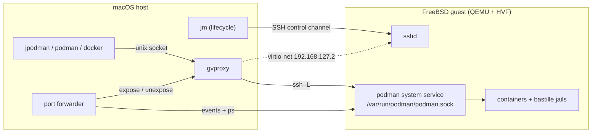

# jailmachine

`jailmachine` (`jm`) is `docker-machine` / `podman machine` for FreeBSD. One
command brings up a FreeBSD 15.1 virtual machine on your Mac, provisions it
with `podman` and `bastille`, and hands your host's `podman` or `docker`
client an endpoint pointing at it — so you can run **native FreeBSD OCI
images**, **Linux images** through the Linuxulator, and **jails**, from a
macOS terminal, without keeping a FreeBSD box around.

> **Status: MVP / working demo.** This release proves the idea end to end and
> is usable for real work: `jm init && jm start`, then build and run FreeBSD
> and Linux images, publish ports to the host, create jails in the guest.
> It is not yet a Docker Desktop replacement — no host directory sharing,
> container DNS is gvproxy's rather than your Mac's, no autostart at login,
> and `docker` parity stops at `jm env`. Those four are being built on the
> `docker-parity` branch and are not in this release.

## Install

macOS on Apple Silicon only. `qemu` (for HVF) and `podman` (which also ships
`gvproxy`) are required; the cask declares both and creates the `jpodman`
symlink, otherwise they are yours to arrange.

```bash
brew install --cask gabrielbelli/tap/jailmachine

# or:
brew install qemu podman
go install github.com/gabrielbelli/jailmachine/cmd/jm@latest
ln -sf "$(go env GOPATH)/bin/jm" "$(go env GOPATH)/bin/jpodman"

# or, from source (PREFIX defaults to /opt/homebrew):
git clone https://github.com/gabrielbelli/jailmachine && cd jailmachine && make install
```

`jm doctor` checks every tool and machine and prints a fix per failure.
Details in [docs/INSTALL.md](docs/INSTALL.md).

## 60-second quickstart

```bash
jm init      # SSH key, download and verify the guest image, grow the disk, write the seed
jm start     # boot, provision, connect podman, start the port forwarder
```

`jm init` takes about 45–60 s, dominated by the roughly 800 MiB image
download and its mandatory SHA256 check. On the prebaked image a cold first
boot takes about 22 s (32 s was observed once with two other VMs already
running on the host) and a warm start 12–20 s; `--image official:<release>`
provisions a stock FreeBSD cloud image on first boot instead, taking about
2 minutes.

`jpodman` is `podman` pointed at the machine, whatever your default
connection is; jm never repoints a default you already had (`jm start
--set-default` opts in, and on a Mac with no podman connections at all,
podman itself promotes the first one jm registers).

The guest is FreeBSD, so **Linux images need `--os=linux`**:

```bash
jpodman run --rm --os=linux docker.io/alpine echo hi              # Linux, via the Linuxulator
jpodman run --rm ghcr.io/freebsd/freebsd-runtime:15.1 uname -srm  # native FreeBSD
```

Build a native FreeBSD image:

```bash
cat > Containerfile <<'EOF'
FROM ghcr.io/freebsd/freebsd-runtime:15.1
RUN env ASSUME_ALWAYS_YES=yes pkg bootstrap -f && pkg install -y curl && pkg clean -ay
CMD ["uname", "-srm"]
EOF
jpodman build -t jm-demo . && jpodman run --rm jm-demo
```

Publish a port and reach it from the Mac (the forwarder reconciles a second
or two after the container starts, hence the retry):

```bash
jpodman run -d --rm --os=linux -p 8080:80 --name web docker.io/busybox \
  sh -c 'echo hello from the FreeBSD VM > /tmp/index.html && httpd -f -p 80 -h /tmp'
curl --retry 10 --retry-connrefused http://localhost:8080/   # hello from the FreeBSD VM
jm ports              # what is mapped, and why something is not
jpodman rm -f web
```

For the Docker CLI, compose, or plain `podman`: `eval "$(jm env)"` (fish:
`eval (jm env --shell fish)`). There is **no `jdocker` wrapper** in this
release, and compose needs one extra step for Linux images — see
[Docker Hub compatibility](#docker-hub-compatibility).

## How it works

QEMU (`-M virt,accel=hvf`, EDK2 firmware, virtio) boots a FreeBSD 15.1 arm64
guest; networking is [gvproxy](https://github.com/containers/gvisor-tap-vsock),
the same userspace stack `podman machine` uses. Host to guest is SSH only, as
root with a dedicated ed25519 key: FreeBSD has no vsock driver, so the engine
socket is tunnelled over SSH rather than exposed directly.



Published ports are reconciled, not requested: the forwarder watches the
guest's container state and converges gvproxy's mapping table onto it. State
lives in `~/.jailmachine/machines/<name>/` (`JM_HOME` or `--state-root` move
it), so deleting it uninstalls completely. More in
[docs/ARCHITECTURE.md](docs/ARCHITECTURE.md).

## Commands

`[name]` defaults to `jailmachine`. Exit codes: 0 ok, 1 failure, 2 usage.
Every flag and environment variable is in [docs/USAGE.md](docs/USAGE.md).

| Command | Does |
|---|---|
| `jm init [name]` | Create a machine: SSH key, image download and SHA256 check, grow disk, NoCloud seed |
| `jm start [name]` | Boot, provision on first boot, connect podman, start the port forwarder; idempotent |
| `jm stop [name]` | Stop the port forwarder, ask the guest to power off, then the hypervisor and the network provider |
| `jm ssh [name] [-- cmd]` | Root shell, or a command, in the guest |
| `jm podman` / `jpodman` | Run the host podman against the machine, whatever your default connection is |
| `jm env [name]` | Shell exports (`CONTAINER_HOST`, `DOCKER_HOST`) for podman and docker clients |
| `jm ports [name]` | Published container ports, with the error per mapping |
| `jm list` / `jm inspect` | Machines and their computed state (`--json` on both) |
| `jm set [name]` | Change `--cpus`, `--memory`, `--ssh-port`, `--disk` (disk grows only, live if running) |
| `jm console [name]` | Guest serial console log (`-f` to follow) |
| `jm rm [name]` | Remove the machine, its directory and its podman connections |
| `jm doctor` | Check qemu, HVF, EDK2 firmware, gvproxy, podman, ssh, the state root and every machine |
| `jm version` / `jm image build` | Build identity (`--json`); and, for maintainers, sealing a prebaked guest image (about 800 MiB as a `.zst`) |

## Image providers

`jm init --image <source>`. The contract an image must satisfy is in
[docs/guest-contract.md](docs/guest-contract.md) and
[ADR 0003](docs/adr/0003-guest-contract-and-image-sources.md); `JM_IMAGE_BASEURL`
points the prebaked source elsewhere, to test an unpublished image.

| Source | What you get | Verification |
|---|---|---|
| `prebaked` (default), `prebaked:<ver>` | Already-provisioned guest from this repo's `guest-<ver>` GitHub release — this release ships `guest-15.1.0`; first boot is a boot, nothing more | Mandatory `.sha256` sidecar, checked by `jm init` |
| `official`, `official:<release>` | Stock FreeBSD `BASIC-CLOUDINIT-zfs` cloud image, provisioned on first boot | Mandatory `CHECKSUM.SHA256` |
| Path or http(s) URL to `.raw` (or `.img`), `.raw.xz`, `.raw.zst` | Your own disk satisfying the contract; `jm` applies the seed, you own provisioning | Sibling `.sha256` if present, else `image_trusted=false` in `jm inspect` |

## Jails

`bastille` is installed and configured in the guest (ZFS, `bastille0`
loopback, NAT through `pf`); managing jails from the host (`jm jail ...`) is
out of MVP scope ([ADR 0006](docs/adr/0006-scope-boundaries.md)).

```bash
jm ssh -- bastille bootstrap 15.1-RELEASE
jm ssh -- bastille create demo 15.1-RELEASE 10.17.89.10
jm ssh -- bastille cmd demo pkg install -y curl
```

## Docker Hub compatibility

Verified on this Mac against a running machine (podman 6.1.0, guest FreeBSD
15.1-RELEASE-p2 arm64, `compat.linux.osrelease=5.15.0`). Linux images need
`--os=linux` for `pull` and `build`; FreeBSD images — which come from Docker
Hub **and** GHCR — need no flag at all.

| Image | Flag | Result |
|---|---|---|
| `alpine`, `debian:trixie-slim`, `ubuntu:24.04`, `python:3-alpine`, `golang:alpine`, `hello-world` | `--os=linux` | Works |
| `postgres:17-alpine`, `caddy:alpine` | `--os=linux` | Works |
| `nginx:1.31-alpine` | `--os=linux` | Works with one config line: `accept_mutex on;` |
| `redis:alpine` | `--os=linux` | Works with `redis-server --ignore-warnings ARM64-COW-BUG` |
| `node:22-alpine` | `--os=linux` | **No** — the one known-bad image, [details](docs/USAGE.md#node-the-one-known-bad-image) |
| `dougrabson/freebsd15-minimal`, `dougrabson/freebsd14-minimal`, `ghcr.io/freebsd/freebsd-runtime:15.1` and `:14.3` | none | Work (native FreeBSD) |

The full matrix, both workarounds, and the script that produced it
(`demo/hub-matrix.sh`) are in
[docs/USAGE.md](docs/USAGE.md#docker-hub-compatibility-verified).

## What works, and what does not yet

| Capability | State |
|---|---|
| Native FreeBSD OCI images | Works — run and build, e.g. `ghcr.io/freebsd/freebsd-runtime:15.1` |
| Linux images | Works through the Linuxulator, with `--os=linux` |
| `docker.io/nginx` (Linux) | Works with **one config line**: `accept_mutex on;` in the `events` block. Stock nginx registers its listening socket with `EPOLLEXCLUSIVE` when `worker_processes > 1`, which FreeBSD's `linux_epoll` rejects. A ready-made image is in [demo/](demo/README.md#the-nginx-finding) |
| Publishing ports (`-p 8080:80`) | Works — reconciled onto the host by the forwarder |
| Jails | Works — `bastille bootstrap`, `create`, `cmd`, `pkg install` in the guest |
| Docker CLI and compose | Works via `eval "$(jm env)"`. Compose pulls FreeBSD variants, so a Linux image needs `jpodman pull --os=linux <image>` first plus `pull_policy: missing` on the service. No further `docker` parity |
| Several machines at once | Works, but each needs its own SSH port — `jm init --ssh-port 2223 dev`, then `JM_MACHINE=dev jpodman ps` |
| Host directory mounts | **No.** FreeBSD has no virtiofs driver; 9p is what `docker-parity` is building. Use NFS or sshfs meanwhile |
| Container DNS matching the host | **No.** Containers resolve through gvproxy, so split-horizon and VPN names will not match |
| Autostart at login | **No.** Start the machine yourself with `jm start` |
| `docker.io/node` (Linux) | **No.** The one image known to be broken: the binary starts and `node --version` prints, but `console.log` output never reaches the pipe and its HTTP servers do not accept connections. No known workaround in this release |
| A `jdocker` wrapper | **No.** `jpodman` has no docker-named twin here; point docker clients with `eval "$(jm env)"`. A `jdocker` is part of the `docker-parity` work |
| `-p 127.0.0.1:8080:80`, routable VM IP | **No.** A loopback host IP binds the guest's loopback (`jm ports` reports it); gvproxy is NAT, so vmnet/bridged is a later step |
| Intel Macs, Linux and Windows hosts | **No.** Only `darwin/arm64` has a backend; the Linux release binaries are build-only. Apple Virtualization.framework cannot boot FreeBSD/arm64, hence QEMU |

## Documentation

- [docs/INSTALL.md](docs/INSTALL.md) — install paths, requirements, uninstalling
- [docs/USAGE.md](docs/USAGE.md) — every command, flag and environment variable
- [docs/ARCHITECTURE.md](docs/ARCHITECTURE.md) — how the pieces fit together
- [docs/TROUBLESHOOTING.md](docs/TROUBLESHOOTING.md) — symptoms, logs and fixes
- [demo/README.md](demo/README.md) — five published demo images that prove FreeBSD and Linux containers side by side, including a Docker Hub nginx serving traffic under the Linuxulator
- [docs/adr/](docs/adr/) — decisions; [docs/tech-choices.md](docs/tech-choices.md) for the concrete tools
- [CONTRIBUTING.md](CONTRIBUTING.md) — build, test, release

## Licence

BSD-2-Clause. See [LICENSE](LICENSE).
