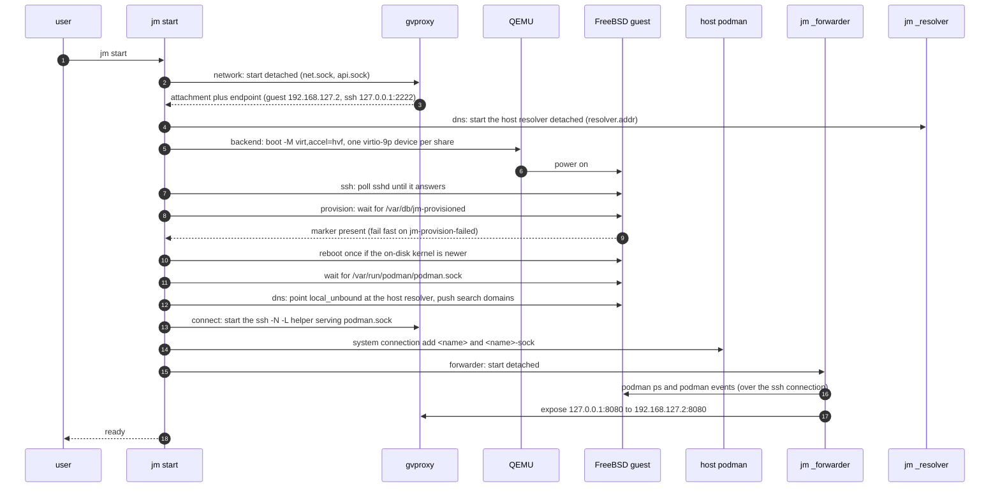

# Architecture

> **Still an MVP — a working demo**, but a wider one than v0.1.0: host
> directory mounts at identical paths ([ADR 0007](adr/0007-host-filesystem-sharing.md)),
> name resolution 1:1 with the host ([ADR 0008](adr/0008-name-resolution-parity.md)),
> autostart on demand from the client wrappers, a `jdocker` wrapper and
> docker-identical `-p` semantics are all in the tree. UDP is in that list
> too — binding, publishing and DNS-over-UDP all work from Linux containers.
> The one Linuxulator gap left is narrow: a zero-length `recvmsg()` returns
> at once on FreeBSD where Linux blocks, which breaks busybox's `nc -u -l`
> and nothing else known.

This page is for a contributor deciding *where* to make a change. The
reasoning behind each decision is in the ADRs, which are linked rather than
restated.

## Three layers

[ADR 0001](adr/0001-system-shape.md) fixes the boundary: container and jail
logic runs inside a FreeBSD kernel, and the host only has to *reach* it.

| Layer | Implemented in | Owns |
|---|---|---|
| Host client (`jm`) | `internal/cli`, `internal/machine` | Lifecycle, images, networking plumbing, diagnostics |
| Control channel | `internal/sshx` | One authenticated SSH channel: readiness probes, command execution, the API tunnel |
| Guest engine | `guest/provision.sh` (which also writes the `podman_service` rc script) | Stock FreeBSD + `podman` + `bastille`, configured once at first boot |

`jm` never parses OCI data and never talks to the container runtime
directly: `podman` and `docker` on the host are clients *of the guest*, and
`jm` only hands them an endpoint.

## The Machine record and the state directory

A **Machine** ([ADR 0002](adr/0002-backend-abstraction.md)) is a
backend-neutral record — name, image reference, CPUs, memory, disk, MAC,
SSH identity, network name, creation time. Everything for one machine lives
under `<state-root>/machines/<name>/`
([ADR 0005](adr/0005-state-and-lifecycle-model.md)), so `rm -rf` of that
directory is a complete uninstall.

| File | Written by |
|---|---|
| `machine.json`, `machine.lock` | `internal/machine` (record; one advisory lock per machine) |
| `disk.raw`, `seed.iso`, `efivars.fd` | `internal/image`, `internal/seed`, `internal/backend/qemu` |
| `ssh/id_ed25519{,.pub}` | `internal/cli` at `init` |
| `qemu.pid`, `qemu.log`, `console.log`, `qmp.sock` | `internal/backend/qemu` |
| `gvproxy.pid`, `gvproxy.log`, `net.sock`, `api.sock`, `podman.sock`, `forward.pid`, `forward.log` | `internal/netprov/gvproxy` |
| `forwarder.pid`, `forwarder.log`, `forwards.json` | `internal/forwarder` |
| `resolver.pid`, `resolver.log`, `resolver.addr` | `internal/resolver` |
| `guest/shares.tab` | `internal/machine` (the share table, itself exported to the guest read-only as the `jmconf` 9p share) |

The record is the source of *configuration*; the source of *runtime state*
is the processes themselves. `State()` is always computed — pid plus argv
liveness, sockets answering — never cached. States are
`stopped ⇄ running`, plus `broken` when the hypervisor and the network
provider disagree (half of the machine is up, or a pid file outlives its
process). `jm stop` converges a broken machine back to stopped.

`sun_path` is 104 bytes including the terminating NUL, so jm caps a unix
socket path at **103** (`backend.MaxSocketPath`, the number `jm doctor`
prints). `backend.SocketPath` moves a socket that would overflow into
`$TMPDIR` under a short deterministic name; `jm rm` calls the backend's
`Cleaner` hook to remove it (ADR 0005 addendum).

## Backend

`backend.Backend` (`internal/backend/backend.go`) is deliberately small:
`Name`, `Preflight`, `Start(ctx, m, NetAttachment)`, `Stop(ctx, m,
graceful)`, `State`, `ConsolePath`, `Logs`, `Capabilities`. It owns
hypervisor processes, firmware variables and the console log — not
networking, not images. Optional behaviour is an optional interface
(`Resizer` for live disk growth via QMP `block_resize`, `Cleaner` for
out-of-tree sockets), never a new required method.

`Capabilities` carries `FileSharing` (ADR 0007): a backend that can export
host paths takes share descriptors at `Start`, and one that cannot is
reported as unsupported with a reason by `jm inspect`, so the CLI refuses a
share request up front instead of letting a mount fail inside a container.

The only implementation is `internal/backend/qemu`:
`qemu-system-aarch64 -M virt,accel=hvf -cpu host`, EDK2 pflash, virtio
disk/seed/NIC/RNG, serial to `console.log`, `-daemonize -pidfile`, control
via QMP. `JM_QEMU_ACCEL=tcg` swaps in pure emulation (and `-cpu
cortex-a72`) for CI; `stageTimeout` multiplies every start timeout by 8
when it detects TCG.

**Apple Virtualization.framework (and `vfkit`) cannot be used**: it does
not boot a FreeBSD/arm64 guest — the kernel dies straight after the loader
with `No valid device tree blob found!`, and there is no UART to watch it
happen. That is what forced QEMU; see `tech-choices.md`.

## NetworkProvider

`netprov.Provider` ([ADR 0004](adr/0004-networking-as-a-provider-with-reconciled-port-publishing.md))
is independent of the backend and adds a mapping API to the usual
lifecycle: `Expose`/`Unexpose`/`List`, plus `Endpoint(m)` which answers
without the provider running.

`internal/netprov/gvproxy` runs gvproxy detached, before QEMU (the
hypervisor connects *to* it) and outliving it. gvproxy serves the guest NIC
on `net.sock`, hands the guest `192.168.127.2` with gateway `192.168.127.1`,
forwards `127.0.0.1:<ssh-port>` to guest `sshd`, and takes port mappings over
its HTTP control API on `api.sock`. `192.168.127.254` is the **host alias**:
gvproxy translates it to the host's `127.0.0.1`, port for port, which is how
the guest reaches the host resolver and what `host.docker.internal` answers.

gvproxy's own DNS at `192.168.127.1` is deliberately **not** used. It
resolves through Go and has no notion of the Mac's own names, so the guest is
pointed at jm's host resolver instead (see
[Name resolution parity](#name-resolution-parity)); `jm inspect` shows `DNS:`
as the guest's own address, because the guest's `local_unbound` is the
port-53 hop in front of it. Never pass gvproxy `-config`: it silently
disables every default, the zones and the SSH forward included.

gvproxy's own `-forward-sock` is **not** used: gvproxy 0.8.x exits outright
when guest `sshd` is slow to answer, which a FreeBSD first boot routinely
is, taking the VM's network with it. The host-side `podman.sock` is instead
served by a detached `ssh -N -L` helper (`forward.go`, the
`netprov.APIForwarder` interface) started only once the guest is
provisioned. `internal/netprov/user` keeps QEMU slirp as a fallback with no
API socket and no port publishing.

## Guest contract and image sources

[ADR 0003](adr/0003-guest-contract-and-image-sources.md) and
[`guest-contract.md`](guest-contract.md) pin the paths `jm` relies on:
ready marker `/var/db/jm-provisioned`, failure marker
`/var/db/jm-provision-failed`, log `/var/log/jm-provision.log`, API socket
`/var/run/podman/podman.sock` (served by the `podman_service` rc script
`provision.sh` installs). The seed is a NoCloud ISO labelled `cidata`
(`internal/seed`), consumed once by `nuageinit`.

Three sources satisfy that contract and are interchangeable after `init`
(`internal/image`):

| `--image` | Source | First boot | Verified by |
|---|---|---|---|
| `prebaked[:<ver>]` (default) | this repo's `guest-<ver>` release, the version named by `image.GuestVersion` | seconds (already provisioned) | mandatory `.sha256` sidecar |
| `official[:<release>]` | FreeBSD.org cloud image | minutes (full provisioning) | `CHECKSUM.SHA256` |
| path or http(s) URL to `.raw`/`.img`\[`.xz`\|`.zst`\] | yours | yours to arrange | sibling `.sha256` if present, else `image_trusted=false` |

`guest/provision.sh` is the single source of truth for both paths: the
prebaked image is produced by *running* it (`jm image build`), so the fast
path cannot diverge from the slow one. `JM_IMAGE_BASEURL` points the
prebaked source at an unpublished image for testing.

## Host filesystem sharing

[ADR 0007](adr/0007-host-filesystem-sharing.md) makes sharing a backend
capability with one rule: **the guest path equals the host path**. Nothing
rewrites a `-v` argument, so `-v /work/src:/app` resolves in the guest from
any working directory.

- `internal/machine/share.go` owns the `Share` record (host path, guest path,
  read-only, and an opaque length-limited `Tag` derived from the host path),
  canonicalisation, de-duplication and the `MaxShares` ceiling.
- `internal/cli/share.go` owns the CLI surface — the default root set (home
  tree, `/Volumes`, `/private/tmp`, `$TMPDIR`'s parent), `--mount`/`--unmount`
  parsing, and the reconciliation `jm start` performs before it launches: a
  host path that has vanished is dropped with one warning rather than
  refusing to boot.
- `internal/backend/qemu/argv.go` exports one `virtio-9p-pci` device per
  share with a **pinned PCI address**. That pinning is load-bearing: an
  unpinned device shifts the disks' PCI slots, which invalidates the EFI boot
  entry, and the firmware then deletes it for good — a one-way door. The
  qemu tests assert the addressing.
- The guest mounts the shares declaratively from `/etc/fstab` (`late,failok`)
  via the `jm_shares` rc script, **before the engine starts**, reading the
  share table from the read-only `jmconf` share at `/var/db/jm/conf/shares.tab`.
  An unmountable share is a logged non-event; boot completes regardless.

9p semantics are best-effort POSIX and the gaps are contractual: `utimes` is
a silent no-op, `chown`/`mkfifo` fail, and throughput is tens of MB/s. Every
container sees everything shared, read-write by default — the posture note
lives in the README and in `jm init --help`.

## Name resolution parity

[ADR 0008](adr/0008-name-resolution-parity.md) makes resolution parity a
property of the network provider: every name the host resolves, the guest and
its containers resolve to the same answer.

`jm start` launches `jm _resolver <name>` detached (`internal/resolver`),
bound to `127.0.0.1` on an ephemeral port recorded in `resolver.addr`. It
answers through the **host operating system's** resolution API
(`net.Resolver{PreferGo: false}` → libSystem/mDNSResponder), so scoped VPN
resolvers, `/etc/hosts`, search-list expansion and `.local` mDNS all apply
without jm modelling any of them. The guest reaches it at gvproxy's host
alias `192.168.127.254`, with `local_unbound` as the port-53 hop, configured
as a pure forwarder with no cache.

- Well-known aliases (`host.containers.internal`, `host.docker.internal`, the
  Mac's own hostname and `.local` name) are answered locally and never
  forwarded; a host answer of `127.0.0.1` is rewritten to the host alias.
- Search domains come from `scutil --dns`, re-read every 30 s and pushed into
  the guest without a restart, so joining a VPN converges.
- Failure is propagated verbatim. Falling back to a public resolver is
  forbidden: on a split-horizon network it would answer an internal name with
  a public address. If the resolver cannot be brought up, `jm start` warns and
  leaves the guest's previous resolution alone; `jm doctor` is what reports
  the loss.
- `jm doctor` asserts parity rather than liveness, and asks the *running*
  resolver rather than its own build: the reserved name
  `resolver.jailmachine.internal` (TXT `mode=host|go`) says how the process
  serving the guest resolves, and a name from the host's own tables that the
  alias table does not hold is compared address for address with what the
  host answers. An alias round trip proves the alias table only — those names
  never reach the host resolver.

> **Never** build with `-tags netgo` or set `GODEBUG=netdns=go`: the pure-Go
> resolver loses scoped and `.local` names while public ones keep working,
> which is an invisible regression. On darwin `net/cgo_unix.go` is compiled
> even with `CGO_ENABLED=0`, so the release build stays pure Go and still
> resolves through the system.

## Autostart

There is no login agent and no `jm autostart` command. `jpodman`, `jdocker`
and their `jm podman` / `jm docker` equivalents start a stopped machine on
demand (`internal/cli/autostart.go`), waiting on a blocking per-machine lock
so that concurrent wrappers queue rather than fail. `JM_AUTOSTART=0`,
`JM_NO_AUTOSTART=1` or a leading `--no-autostart` opts out. A launchd
`KeepAlive` agent would loop: `jm start` is one-shot and leaves qemu,
gvproxy, the forwarder and the resolver detached.

## Port publishing is a reconciliation loop

There is no guest agent and no RPC from the engine. `jm start` launches
`jm _forwarder <name>` detached (`internal/forwarder`), which:

1. derives the **desired** set of mappings from `podman --connection <name>
   ps --format json` (`desired.go`: each published host port maps to the
   same port on the guest IP, and the host address it binds is the one
   docker would bind);
2. **converges** gvproxy's table to it, touching only mappings it owns —
   the owned set is persisted atomically in `forwards.json`, so a restarted
   forwarder never unexposes the SSH port or a hand-made mapping;
3. re-runs on `podman events` (debounced 300 ms), on a 30 s timer, and on
   reconnect with exponential backoff.

Failures are per mapping, not per container: a busy host port is recorded
as an `error` on that entry and retried at the next resync. `jm ports` and
`jm inspect` read `forwards.json` and never block on the machine.

The host side binds `0.0.0.0` by default, as `docker run -p` does on Linux.
The address is a **machine property** (`jm init/set --publish-addr`, with
`$JM_PUBLISH_ADDR` folded into the record at `jm start`), not ambient state
of the shell that booted the machine: the forwarder runs detached, so a
variable read inside it would be invisible to `jm inspect` and `jm ports`.
`internal/cli/publish.go` owns that folding. It is a **default**: an address
written into the publish flag itself wins over it, as it does under docker.
A running forwarder keeps the address it started with, and records it in
`forwards.json`, so `jm ports`/`jm inspect` can show what is bound and mark
a changed record as pending.

### The guest-side half

The engine in the guest reads the address in `-p 127.0.0.1:8080:80` as a
*guest*-side bind address and redirects the guest's loopback, where nothing
on the host can reach it; the literal `0.0.0.0` gets a redirect to the
wildcard, which matches no packet; `[::1]` gets no redirect at all. Docker's
meaning is the opposite — a host-side bind address the VM never sees — so jm
does both halves itself:

- the host leg is gvproxy's, bound at the address the user wrote;
- the guest leg is a `rdr` rule jm loads into its own pf anchor, `rdr/jm`
  (a sub-anchor of the `rdr/*` the guest image already declares), pointing
  the guest's own address at the container's address on the container
  network. `forwarder.Rule`/`AnchorText` build it; `internal/cli`'s
  `sshGuest` loads it over the existing SSH control channel.

The anchor is written whole on every change, so it is a pure function of the
desired state: nothing accumulates, a killed forwarder's rules are replaced
at the next start, and a container's new address after a restart is picked up
by the next reconcile (the address comes from a batched `podman inspect`,
issued only for containers whose publish needs a rule). A failure of either
half is an error on that mapping, retried at the next resync — never a
dropped mapping.

This is the one place the guest is no longer entirely unaware of the host;
[ADR 0004](adr/0004-networking-as-a-provider-with-reconciled-port-publishing.md)
records the amendment.

## `jm start`, stage by stage

Start is staged, idempotent and resumable: on a running machine it skips
the boot and re-checks the rest; on a broken one it repairs first. Every
failure is a `machine.StageError` naming the stage and the log to read.

| Stage | Does | Fails on |
|---|---|---|
| `network` | gvproxy up, endpoint resolved | gvproxy missing or exiting → `gvproxy.log` |
| `backend` | QEMU boot | firmware/disk missing, HVF unavailable, socket path too long → `qemu.log`, `console.log` |
| `ssh` | poll guest `sshd` (5 min) | guest not booting → `console.log`; bails out early if QEMU or gvproxy died |
| `provision` | wait for the ready marker (15 min), fail fast on the failure marker; reboot once if `freebsd-version -k` ≠ `-r`; then wait for the guest podman socket (30 s) | provisioning aborted, packages missing, `podman_service` down → guest `/var/log/jm-provision.log` |
| `connect` | `ssh -N -L` API forward, register the `<name>` and `<name>-sock` podman connections | podman not installed → `forward.log` |
| `dns` (host half, between `network` and `backend`) | launch the detached host resolver | → `resolver.log`; a failure warns and carries on with the guest's previous resolution |
| `dns` (guest half, after `provision`) | give the guest one nameserver — the host resolver — and push the search domains | as above |
| `forwarder` | launch the detached reconciliation loop | → `forwarder.log`; skipped when the provider has no guest IP |

Shares are reconciled before the `backend` stage — a host path that has
vanished is dropped with one warning rather than refusing the boot — and a
guest image too old to carry the `jm_shares` service is called out during
`provision`, because attaching the devices and mounting nothing is otherwise
silent. The guest's `jm-rtcsync` steps the clock from the EFI RTC, so a
machine resumed after the Mac slept does not run behind.

## Where to change what

| Change | Package |
|---|---|
| New host platform / hypervisor | `internal/backend/<name>` implementing `backend.Backend` |
| Different networking (vmnet, bridged) | `internal/netprov/<name>` implementing `netprov.Provider` |
| New image source or verification | `internal/image` |
| Anything the guest must have | `guest/provision.sh` only — then rebuild the prebaked image |
| Port publishing behaviour | `internal/forwarder` (`desired.go` for policy and the guest-side rules, `converge.go` for mechanics); the host bind address in `internal/cli/publish.go`; the SSH loader in `internal/cli/forwarder.go` |
| Host directory sharing | `internal/machine/share.go` (record), `internal/cli/share.go` (defaults and CLI), `internal/backend/qemu/argv.go` (9p devices), `guest/provision.sh` (the `jm_shares` rc script) |
| Name resolution | `internal/resolver` (host resolver, guest push, aliases) |
| Autostart | `internal/cli/autostart.go`, used by `podman.go` and `docker.go` |
| Commands, flags, output | `internal/cli` (one file per subcommand) |

New work enters scope only if it fits an existing interface, or comes with a
new ADR that widens one deliberately
([ADR 0006](adr/0006-scope-boundaries.md)).
