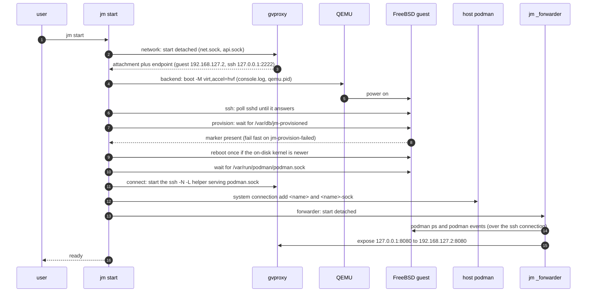

# Architecture

> **This release is an MVP — a working demo.** It proves the whole idea end
> to end and is usable day to day, but the polished behaviour (host
> directory mounts at identical paths, DNS 1:1 with the host, autostart,
> `docker` CLI parity) is being built right now on the `docker-parity`
> branch and is **not** in this release.

This page is for a contributor deciding *where* to make a change. The
reasoning behind each decision is in the ADRs, which are linked rather than
restated.

## Three layers

[ADR 0001](adr/0001-system-shape.md) fixes the boundary: container and jail
logic runs inside a FreeBSD kernel, and the host only has to *reach* it.

| Layer | Implemented in | Owns |
|---|---|---|
| Host client (`jm`) | `internal/cli`, `internal/machine` | Lifecycle, images, networking plumbing, diagnostics |
| Control channel | `internal/sshx` | One authenticated SSH channel: readiness probes, command execution, the API tunnel |
| Guest engine | `guest/provision.sh` (which also writes the `podman_service` rc script) | Stock FreeBSD + `podman` + `bastille`, configured once at first boot |

`jm` never parses OCI data and never talks to the container runtime
directly: `podman` and `docker` on the host are clients *of the guest*, and
`jm` only hands them an endpoint.

## The Machine record and the state directory

A **Machine** ([ADR 0002](adr/0002-backend-abstraction.md)) is a
backend-neutral record — name, image reference, CPUs, memory, disk, MAC,
SSH identity, network name, creation time. Everything for one machine lives
under `<state-root>/machines/<name>/`
([ADR 0005](adr/0005-state-and-lifecycle-model.md)), so `rm -rf` of that
directory is a complete uninstall.

| File | Written by |
|---|---|
| `machine.json`, `machine.lock` | `internal/machine` (record; one advisory lock per machine) |
| `disk.raw`, `seed.iso`, `efivars.fd` | `internal/image`, `internal/seed`, `internal/backend/qemu` |
| `ssh/id_ed25519{,.pub}` | `internal/cli` at `init` |
| `qemu.pid`, `qemu.log`, `console.log`, `qmp.sock` | `internal/backend/qemu` |
| `gvproxy.pid`, `gvproxy.log`, `net.sock`, `api.sock`, `podman.sock`, `forward.pid`, `forward.log` | `internal/netprov/gvproxy` |
| `forwarder.pid`, `forwarder.log`, `forwards.json` | `internal/forwarder` |

The record is the source of *configuration*; the source of *runtime state*
is the processes themselves. `State()` is always computed — pid plus argv
liveness, sockets answering — never cached. States are
`stopped ⇄ running`, plus `broken` when the hypervisor and the network
provider disagree (half of the machine is up, or a pid file outlives its
process). `jm stop` converges a broken machine back to stopped.

`sun_path` is 104 bytes including the terminating NUL, so jm caps a unix
socket path at **103** (`backend.MaxSocketPath`, the number `jm doctor`
prints). `backend.SocketPath` moves a socket that would overflow into
`$TMPDIR` under a short deterministic name; `jm rm` calls the backend's
`Cleaner` hook to remove it (ADR 0005 addendum).

## Backend

`backend.Backend` (`internal/backend/backend.go`) is deliberately small:
`Name`, `Preflight`, `Start(ctx, m, NetAttachment)`, `Stop(ctx, m,
graceful)`, `State`, `ConsolePath`, `Logs`, `Capabilities`. It owns
hypervisor processes, firmware variables and the console log — not
networking, not images. Optional behaviour is an optional interface
(`Resizer` for live disk growth via QMP `block_resize`, `Cleaner` for
out-of-tree sockets), never a new required method.

The only implementation is `internal/backend/qemu`:
`qemu-system-aarch64 -M virt,accel=hvf -cpu host`, EDK2 pflash, virtio
disk/seed/NIC/RNG, serial to `console.log`, `-daemonize -pidfile`, control
via QMP. `JM_QEMU_ACCEL=tcg` swaps in pure emulation (and `-cpu
cortex-a72`) for CI; `stageTimeout` multiplies every start timeout by 8
when it detects TCG.

**Apple Virtualization.framework (and `vfkit`) cannot be used**: it does
not boot a FreeBSD/arm64 guest — the kernel dies straight after the loader
with `No valid device tree blob found!`, and there is no UART to watch it
happen. That is what forced QEMU; see `tech-choices.md`.

## NetworkProvider

`netprov.Provider` ([ADR 0004](adr/0004-networking-as-a-provider-with-reconciled-port-publishing.md))
is independent of the backend and adds a mapping API to the usual
lifecycle: `Expose`/`Unexpose`/`List`, plus `Endpoint(m)` which answers
without the provider running.

`internal/netprov/gvproxy` runs gvproxy detached, before QEMU (the
hypervisor connects *to* it) and outliving it. gvproxy serves the guest NIC
on `net.sock`, hands the guest `192.168.127.2` with gateway/DNS
`192.168.127.1`, forwards `127.0.0.1:<ssh-port>` to guest `sshd`, and takes
port mappings over its HTTP control API on `api.sock`.

gvproxy's own `-forward-sock` is **not** used: gvproxy 0.8.x exits outright
when guest `sshd` is slow to answer, which a FreeBSD first boot routinely
is, taking the VM's network with it. The host-side `podman.sock` is instead
served by a detached `ssh -N -L` helper (`forward.go`, the
`netprov.APIForwarder` interface) started only once the guest is
provisioned. `internal/netprov/user` keeps QEMU slirp as a fallback with no
API socket and no port publishing.

## Guest contract and image sources

[ADR 0003](adr/0003-guest-contract-and-image-sources.md) and
[`guest-contract.md`](guest-contract.md) pin the paths `jm` relies on:
ready marker `/var/db/jm-provisioned`, failure marker
`/var/db/jm-provision-failed`, log `/var/log/jm-provision.log`, API socket
`/var/run/podman/podman.sock` (served by the `podman_service` rc script
`provision.sh` installs). The seed is a NoCloud ISO labelled `cidata`
(`internal/seed`), consumed once by `nuageinit`.

Three sources satisfy that contract and are interchangeable after `init`
(`internal/image`):

| `--image` | Source | First boot | Verified by |
|---|---|---|---|
| `prebaked[:<ver>]` (default) | this repo's `guest-<ver>` release (`guest-15.1.0` in this release) | seconds (already provisioned) | mandatory `.sha256` sidecar |
| `official[:<release>]` | FreeBSD.org cloud image | minutes (full provisioning) | `CHECKSUM.SHA256` |
| path or http(s) URL to `.raw`/`.img`\[`.xz`\|`.zst`\] | yours | yours to arrange | sibling `.sha256` if present, else `image_trusted=false` |

`guest/provision.sh` is the single source of truth for both paths: the
prebaked image is produced by *running* it (`jm image build`), so the fast
path cannot diverge from the slow one. `JM_IMAGE_BASEURL` points the
prebaked source at an unpublished image for testing.

## Port publishing is a reconciliation loop

There is no guest agent and no RPC from the engine. `jm start` launches
`jm _forwarder <name>` detached (`internal/forwarder`), which:

1. derives the **desired** set of mappings from `podman --connection <name>
   ps --format json` (`desired.go`: each published host port maps to the
   same port on the guest IP);
2. **converges** gvproxy's table to it, touching only mappings it owns —
   the owned set is persisted atomically in `forwards.json`, so a restarted
   forwarder never unexposes the SSH port or a hand-made mapping;
3. re-runs on `podman events` (debounced 300 ms), on a 30 s timer, and on
   reconnect with exponential backoff.

Failures are per mapping, not per container: a busy host port is recorded
as an `error` on that entry and retried at the next resync. `jm ports` and
`jm inspect` read `forwards.json` and never block on the machine. A port
podman bound to a loopback `host_ip` in the guest can never be forwarded and
is listed with a reason instead.

## `jm start`, stage by stage

Start is staged, idempotent and resumable: on a running machine it skips
the boot and re-checks the rest; on a broken one it repairs first. Every
failure is a `machine.StageError` naming the stage and the log to read.

| Stage | Does | Fails on |
|---|---|---|
| `network` | gvproxy up, endpoint resolved | gvproxy missing or exiting → `gvproxy.log` |
| `backend` | QEMU boot | firmware/disk missing, HVF unavailable, socket path too long → `qemu.log`, `console.log` |
| `ssh` | poll guest `sshd` (5 min) | guest not booting → `console.log`; bails out early if QEMU or gvproxy died |
| `provision` | wait for the ready marker (15 min), fail fast on the failure marker; reboot once if `freebsd-version -k` ≠ `-r`; then wait for the guest podman socket (30 s) | provisioning aborted, packages missing, `podman_service` down → guest `/var/log/jm-provision.log` |
| `connect` | `ssh -N -L` API forward, register the `<name>` and `<name>-sock` podman connections | podman not installed → `forward.log` |
| `forwarder` | launch the detached reconciliation loop | → `forwarder.log`; skipped when the provider has no guest IP |

## Where to change what

| Change | Package |
|---|---|
| New host platform / hypervisor | `internal/backend/<name>` implementing `backend.Backend` |
| Different networking (vmnet, bridged) | `internal/netprov/<name>` implementing `netprov.Provider` |
| New image source or verification | `internal/image` |
| Anything the guest must have | `guest/provision.sh` only — then rebuild the prebaked image |
| Port publishing behaviour | `internal/forwarder` (`desired.go` for policy, `converge.go` for mechanics) |
| Commands, flags, output | `internal/cli` (one file per subcommand) |

New work enters scope only if it fits an existing interface, or comes with a
new ADR that widens one deliberately
([ADR 0006](adr/0006-scope-boundaries.md)).
